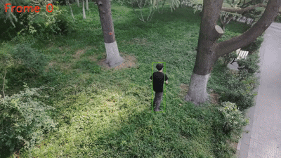
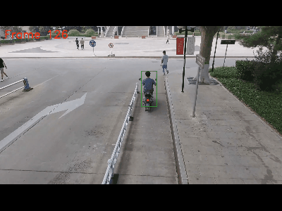
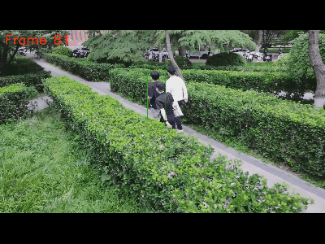
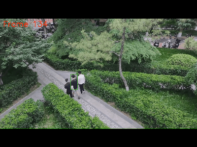
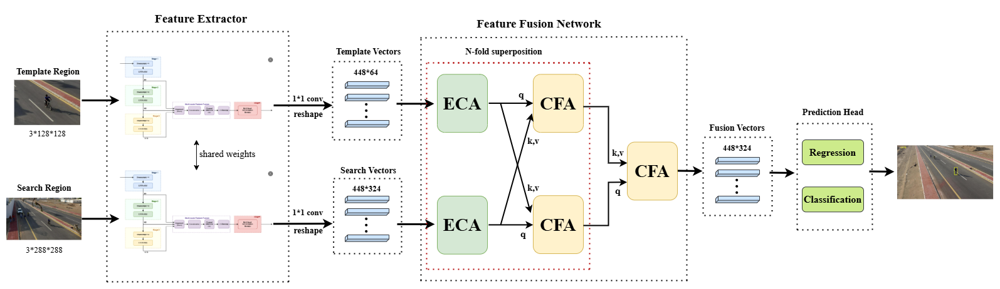
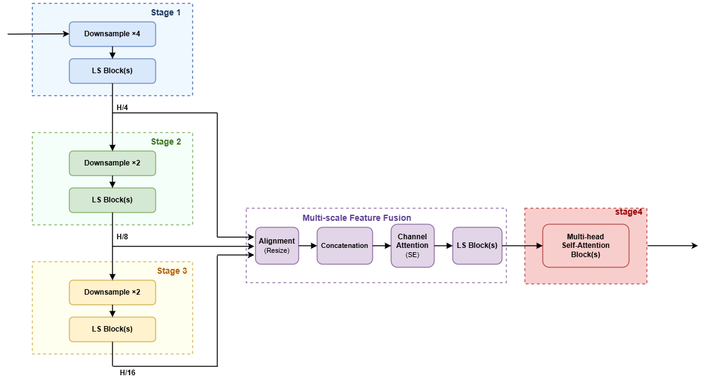
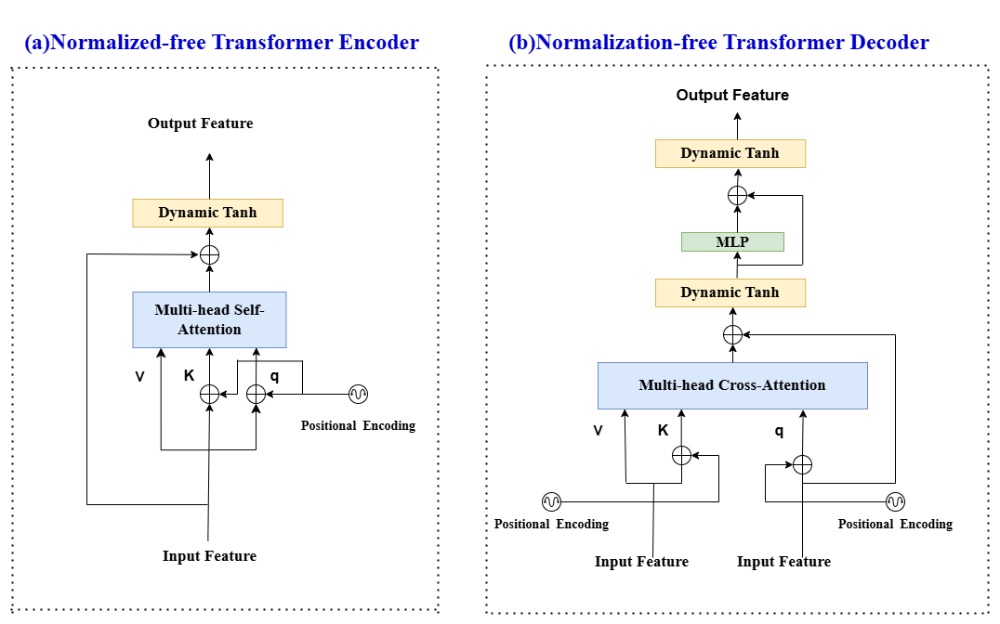

# LSfpnNet-DYT: Single Object Tracking with LSNet Backbone and DyT Normalization

<p align="center">
  <em>Single Object Tracking Demos</em>
</p>

<table align="center">
  <tr>
    <td align="center"></td>
    <td align="center"></td>
  </tr>
  <tr>
    <td align="center"></td>
    <td align="center"></td>
  </tr>
</table>

A PyTorch-based single object tracking (SOT) framework featuring an **LSNet backbone** with multi-stage feature alignment, **DyT (Dynamic Tanh) normalization** replacing standard LayerNorm, and a **Transformer-based feature fusion network** for template-search region interaction.

## Architecture Overview

<p align="center">
  
</p>

### Key Components

| Component | Description |
|-----------|-------------|
| **LSNet Backbone** | Efficient CNN backbone with RepVGGDW, LSConv (Large Kernel Conv + SKA), and multi-head self-attention |
| **ThreeStageAlign** | Fuses features from stages 1-3 to a unified 1/16 resolution via lateral convolutions |
| **DyT (Dynamic Tanh)** | Replaces LayerNorm with learnable `tanh(alpha * x) * weight + bias` |
| **Feature Fusion Network** | Transformer encoder-decoder with bidirectional cross-attention between template and search features |
| **SKA (Spatial Kernel Attention)** | Triton-accelerated spatial kernel attention for efficient large-kernel convolution |

<p align="center">
  
</p>

<p align="center">
  
</p>

### Backbone Variants

| Variant | Stages | Channels | Depth | Output Channels |
|---------|--------|----------|-------|-----------------|
| LSNetV1 | 3 | [96, 192, 320] | [1, 2, 8] | 320 |
| **LSNetV2** (default) | 4 | [96, 192, 320, 448] | [1, 2, 8, 2] | 448 |
| LSNetV3 | 4 | [96, 192, 320, 448] | [1, 2, 8, 8] | 448 |

## Environment Setup

### Requirements

- Python >= 3.7
- PyTorch >= 1.8
- CUDA (recommended for training and inference)
- Triton (required for SKA module)

### Installation

```bash
# 1. Create conda environment
conda create -n sot python=3.7
conda activate sot

# 2. Install PyTorch (>=1.8)
# For CUDA 11.x:
pip install torch torchvision torchaudio --index-url https://download.pytorch.org/whl/cu118
# Or for CPU only:
pip install torch torchvision torchaudio --index-url https://download.pytorch.org/whl/cpu

# 3. Install other dependencies
pip install opencv-python numpy matplotlib yacs tqdm

# 4. Install Triton (for SKA acceleration)
pip install triton

# 5. Add project root to PYTHONPATH
# Linux/Mac:
export PYTHONPATH=<path_to_project>:$PYTHONPATH
# Windows (PowerShell):
$env:PYTHONPATH = "<path_to_project>;$env:PYTHONPATH"
```

### Dataset Preparation

Set dataset paths in `ltr/admin/local.py`:

```python
class EnvironmentSettings:
    def __init__(self):
        self.workspace_dir = './ltr/workspace'
        self.got10k_dir = '/path/to/got10k/got10k_train'
        self.lasot_dir = '/path/to/lasot'
        self.coco_dir = '/path/to/coco'
        self.trackingnet_dir = '/path/to/trackingnet'
        # ... other dataset paths
```

Supported training datasets: GOT-10k, LaSOT, COCO, TrackingNet, ImageNet-VID, and more.

## Training

```bash
conda activate sot
cd <path_to_project>
python ltr/run_training.py default default
```

Training settings can be customized in `ltr/train_settings/default/default.py`:
- Backbone variant selection
- Feature sizes, hidden dimensions, attention heads
- Dataset combinations and sampling ratios
- Learning rate schedule, batch size, etc.

## Inference / Testing

### Test on benchmark datasets

```bash
# OTB100
python -u pysot_toolkit/test_otb.py --dataset OTB100 --name 'sot'

# NFS240
python -u pysot_toolkit/test_nfs.py --dataset NFS240 --name 'sot'

# UAV123
python -u pysot_toolkit/test_uav.py --dataset UAV123 --name 'sot'

# Evaluate results
python pysot_toolkit/eval.py --tracker_path results/ --dataset <dataset_name> --num 1 --tracker_prefix 'sot'
```

### Track on video

```bash
python pytracking/run_video.py sot sot /path/to/video.mp4
```

### Track on webcam

```bash
python pytracking/run_webcam.py sot sot
```

## Project Structure

```
├── ltr/                          # Training framework
│   ├── actors/                   # Training actors (forward pass + loss computation)
│   ├── admin/                    # Environment settings, model loading
│   ├── data/                     # Data processing, sampling, transforms
│   ├── dataset/                  # Dataset integrations (GOT-10k, LaSOT, COCO, etc.)
│   ├── models/
│   │   ├── backbone/             # LSNet backbone implementations
│   │   │   ├── lsnet_backbone.py # Base backbone (LSNetBackbone16x)
│   │   │   ├── lsnet_v1.py       # Lightweight variant
│   │   │   ├── lsnet_v2.py       # Balanced variant (default)
│   │   │   ├── lsnet_v3.py       # Full variant
│   │   │   ├── backbone_builder.py # Backbone wrapper + position encoding
│   │   │   └── ska.py            # Spatial Kernel Attention (Triton)
│   │   ├── neck/                 # Feature fusion network
│   │   │   ├── featurefusion_network.py  # Transformer encoder-decoder
│   │   │   ├── DYT_EASY.py       # DyT normalization
│   │   │   └── position_encoding.py
│   │   ├── tracking/             # Main tracking model
│   │   │   └── sot_model.py      # SOTTracker + SetCriterion
│   │   └── loss/                 # Matcher module
│   ├── train_settings/           # Training configurations
│   ├── utils/                     # Utility modules
│   │   ├── cam_visualize.py       # Grad-CAM and attention heatmap tools
│   │   └── model_analysis.py      # FLOPs and parameter counting
│   └── run_training.py           # Training entry point
├── pytracking/                   # Inference framework
│   ├── tracker/sot_tracker/      # Tracker implementation
│   ├── parameter/sot_default/    # Tracker parameters
│   ├── evaluation/               # Benchmark evaluation
│   └── run_video.py              # Video tracking entry point
├── pysot_toolkit/                # Evaluation toolkit
├── got10k_toolkit/               # GOT-10k evaluation toolkit
├── tools/                        # Analysis tools
│   └── analyze_model.py          # FLOPs + CAM analysis script
└── LICENSE                       # GPLv3
```

## Customization

### Switch Backbone Variant

Edit `ltr/models/backbone/backbone_builder.py`:

```python
# Uncomment the desired variant and comment out others

class Backbone(BackboneBase):
    """LSNet backbone V1 (lightweight)."""
    def __init__(self, pretrained=False):
        backbone = LSNetV1(pretrained=pretrained)
        num_channels = 320
        super().__init__(backbone, num_channels)
```

### Modify Transformer Config

Edit `ltr/train_settings/default/default.py`:

```python
settings.hidden_dim = 256          # Transformer hidden dimension
settings.nheads = 8                # Number of attention heads
settings.dim_feedforward = 1024    # FFN intermediate dimension
settings.featurefusion_layers = 2  # Number of encoder layers
settings.dropout = 0.1             # Dropout rate
```

## Model Analysis Tools

### FLOPs & Parameters

Analyze model complexity with one command:

```bash
# Exact calculation via thop
python tools/analyze_model.py --mode flops --use_thop

# Manual estimation (no extra dependencies)
python tools/analyze_model.py --mode flops --no_thop

# Custom configuration
python tools/analyze_model.py --mode flops \
    --hidden_dim 256 --nheads 8 \
    --dim_feedforward 1024 --featurefusion_layers 2 \
    --search_size 288 --template_size 128
```

This will print FLOPs, total/trainable parameters, and a per-module breakdown.

### CAM Heatmap Visualization

Visualize where the model focuses during tracking:

```bash
# Grad-CAM heatmap
python tools/analyze_model.py --mode cam \
    --checkpoint path/to/model.pth.tar \
    --image path/to/search.jpg \
    --template path/to/template.jpg \
    --cam_layer input_proj

# Multi-layer Grad-CAM grid
python tools/analyze_model.py --mode cam \
    --checkpoint path/to/model.pth.tar \
    --image path/to/search.jpg \
    --template path/to/template.jpg \
    --grid

# Cross-attention heatmap
python tools/analyze_model.py --mode cam \
    --checkpoint path/to/model.pth.tar \
    --image path/to/search.jpg \
    --template path/to/template.jpg \
    --cross_attn

# Full analysis
python tools/analyze_model.py --mode all \
    --checkpoint path/to/model.pth.tar \
    --image path/to/search.jpg \
    --template path/to/template.jpg
```

Also available as Python API:

```python
from ltr.utils import analyze_model, count_flops, count_params
from ltr.utils import generate_cam_heatmap, CAMVisualizer

# FLOPs & Params
results = analyze_model(model, search_size=(288, 288), use_thop=True)

# CAM heatmap
cam_results = generate_cam_heatmap(
    model, search_tensor, template_tensor,
    target_layer='input_proj', image_np=search_img,
    save_path='gradcam.png'
)
```

## License

This project is released under the [GNU General Public License v3.0](LICENSE).

## Citation

This project is built upon the following works. If you find this project useful, please consider citing:

```bibtex
@inproceedings{chen2021transt,
  title={TransT: Transformer Tracking},
  author={Chen, Xin and Wang, Zongxin and Peng, Yibing and Zhang, Jianpeng and Feng, Jiashi},
  booktitle={Proceedings of the IEEE/CVF Conference on Computer Vision and Pattern Recognition (CVPR)},
  year={2021}
}

@misc{wang2025lsnet,
  title={LSNet: See Large, Focus Small},
  author={Wang, Ao and Chen, Hui and Lin, Zijia and Han, Jungong and Ding, Guiguang},
  year={2025},
  eprint={2503.23135},
  archivePrefix={arXiv},
  primaryClass={cs.CV}
}
```

- [TransT](https://github.com/chenxin-dlut/TransT) - Transformer Tracking (CVPR 2021)
- [LSNet](https://github.com/THU-MIG/lsnet) - See Large, Focus Small, by Wang et al. (CVPR 2025)

## Contact

If you have any questions, please contact: zqb20022002@163.com

